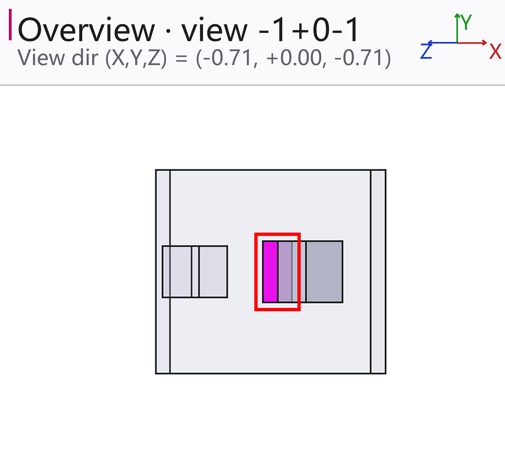
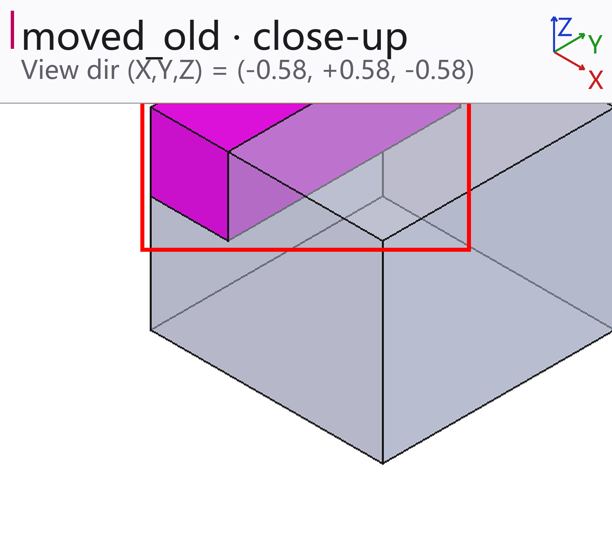
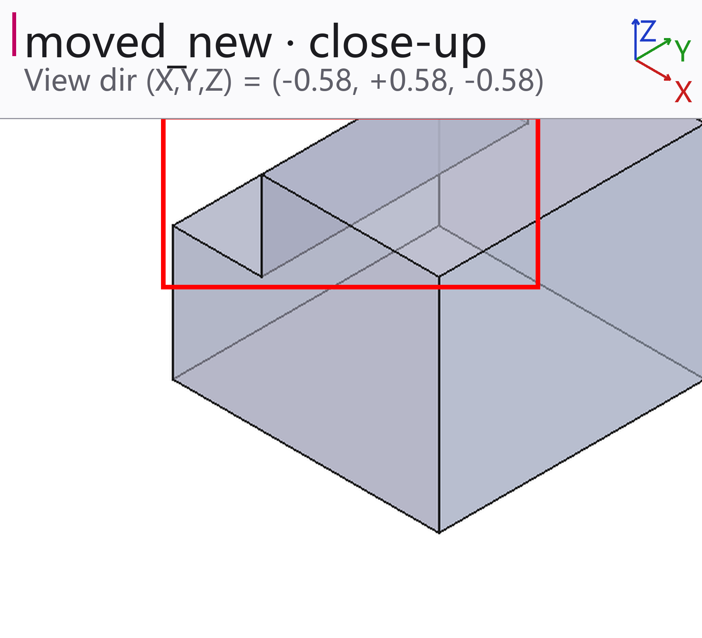
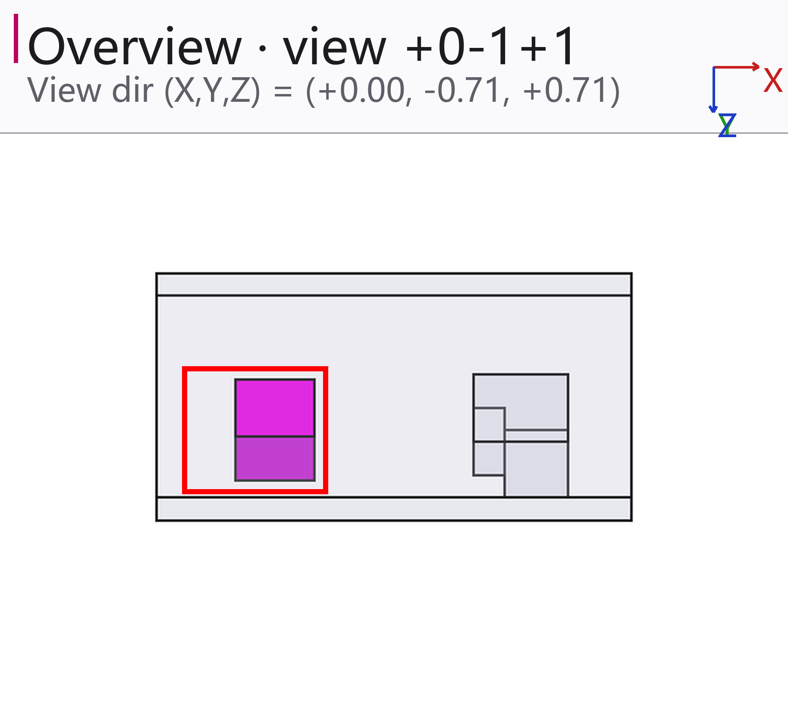
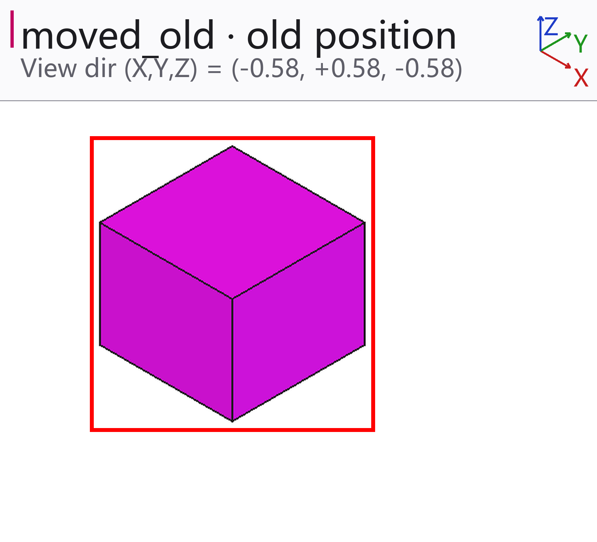
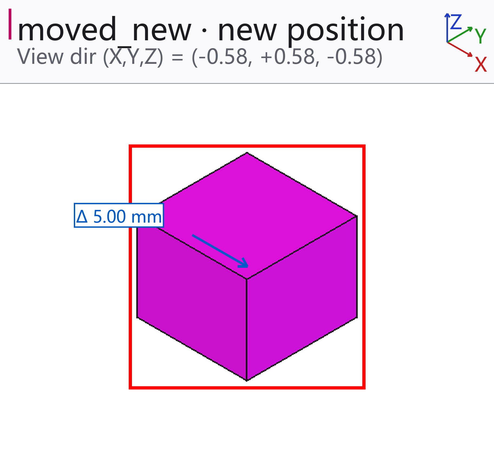

# Geometry diff report — Old → New

2 geometric change(s), 0 BOM-level change(s)

## Geometric changes

### 1. BRACKET_03 — shape changed

- Volume change: `192.00 mm³`
- Volume change (%): `15.38 %`
- Material removed: `192.0000 mm³`
- Material added: `0.0000 mm³`
- Separate clusters: `1`
- Changed extent: `4.0 × 12.0 × 4.0 mm`

### 2. SLIDER_02 — moved

- Translation: `5.00 mm`
- Changed extent: `10.0 × 10.0 × 8.0 mm`

## Not compared / not resolved

- **MovedFixture** — assembly container — its shape is the union of its children, so it is not counted separately

---
Generated by caddiff · manifest version 1
